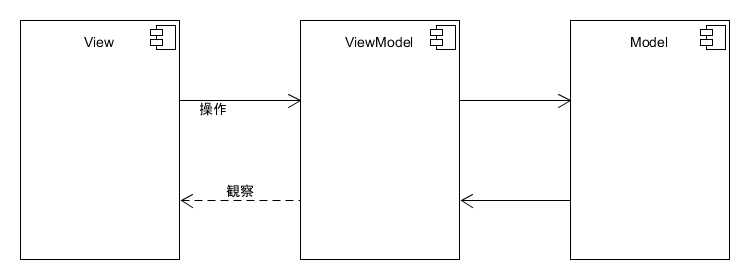

# Model - View - View Model アーキテクチャ (MVVM)

Googleによる推奨アンドロイドアーキテクチャはMVVMです



## Model (モデル)

モデルがデータを管理します。  
データを管理する為に`repository`パターンを利用します。

```kotlin
interface MyRepository {

    fun getData(): String

}

class MyPositoryImpl {

    override fun getData(): String {
        return "my data"
    }

}
```

## View Model (ビューモデル)

ビューモデルがビューのステートを管理します。  
モデルにリクエストをして、ビューのステートを更新します。  
ビューモデルにビューのインスタンスを持っていませんので、オブサーバーを更新します。

```kotlin
import androidx.lifecycle.ViewModel

class MyViewModel : ViewModel() {

}
```

ビューモデルをインスタンスする為に`ViewlModelProviders`を利用します。

```kotlin
import androidx.lifecycle.ViewModelProviders

class MyFragment : Fragment() {

    override onViewCreated(view: View, savedInstanceState: Bundle?) {
        val model = ViewlModelProviders.of(this).get(MyViewModel::class.java)

        // ...
    }

}
```

※`onDestroyView`を呼び出した後にビューモデルのインスタンスがまだ存在しています。

※`onDestroy`を呼び出した後にビューモデルのインスタンスが存在しない

## View (ビュー)

Androidにビューがアクティビティ、フラグメント、ビューです。  
ビューがViewModel（ビューモデル）にアクセスできますが、ビューモデルがビューをアクセスできません。  
ビューモデルにビューのインスタンスが存在しません。  
ビューがビューモデルを観察します。

## View ModelとViewのコミュニケーション

ビューとビューモデルを連携する為に`LiveData`オブジェクトを利用します。

- ビューモデルがLiveDataに値を設定します
- ビューがLiveDataの修正を観察します。

```kotlin
import androidx.lifecycle.LiveData
import androidx.lifecycle.MutableLiveData
import androidx.lifecycle.ViewModel

class MyViewModel : ViewModel() {

    private val name = MutableLiveData<String>().apply {
        value = ""
    }

    fun observeName(owner: LifecycleOwner, observer: (String) -> Unit) {
        this.name.observe(owner, Observer {
            val value = it ?: return@Observer
            observer(value)
        })
    }

    fun fetchName(n: Int) {
        name.value = "name $n"
    }
}
```

```kotlin
import androidx.lifecycle.ViewModelProviders

class MyFragment : Fragment() {

    override onViewCreated(view: View, savedInstanceState: Bundle?) {
        val model = ViewModelProviders.of(this).get(Screen1ViewModel::class.java)
        model.observeName(this@Screen1Fragment.viewLifecycleOwner) {
            Log.d("AndroidTutorial", "name: $it")
        }
        model.observeName(this@Screen1Fragment.viewLifecycleOwner, this@Screen1Fragment::showName)

        // ...
    }

    private fun showName(name: String) {
        Log.d("AndroidTutorial", "name: $name")
    }
}
```

## gradle設定

下記のライブラリを追加する

```groovy


dependencies {
    def lifecycle_version = "2.0.0"

    implementation "androidx.lifecycle:lifecycle-extensions:$lifecycle_version"
    implementation "androidx.lifecycle:lifecycle-common-java8:$lifecycle_version"

}
```
